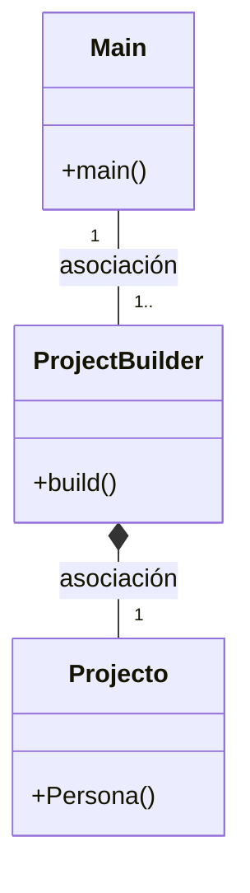

# ¿Cual es la función del patrón builder?
El patrón Builder es un patrón de diseño que se utiliza para crear objetos complejos paso a paso y permitir que el usuario final pueda personalizar el proceso de construcción sin conocer todos los detalles de su implementación.

Por ejemplo podríamos crear una clase Persona con diferentes atributos como nombre, edad, dirección, teléfono, correo... esta clase también tendría sus propios métodos:
getters, setters, constructor y toString.
Posteriormente crearemos la clase Builder en la cual crearemos un objeto de tipo persona con sus propios métodos y finalmente en la
clase main crearemos diferentes objetos de personas a los cuales le podremos meter diferentes atributos gracias a sus respectivos métodos y acompañado del metodo build()

# Diagrama Ejemplo

# ¿Podríamos combinarlo con el patrón Factory? 
Sí, se podría combinar el patrón de diseño "Builder" con el patrón de diseño "Factory". La idea sería tener una clase "PersonaFactory" que tenga un método que devuelva un objeto de la clase "PersonaBuilder".

Para implementar la combinacion de los patrones Builder y Factory podriamos crear una clase abstracta llamada "PersonaBuilderFactory" que contenga un metodo llamado "crearPersonaBuilder". Esta clase tendría dos subclase, una para crear objetos de tipo Trabajador en una clase "TrabajadorBuilder" y otra
para crear objetos de tipo Estudiante en una clase "EstudianteBuilder"

Las clases de trabajador y estudiante extienden de la clase PersonaBuilder y contienen atributos como trabajoActual, fechainicioTrabajo, carreraEstudiada, añoDeEstudio...
esta clase tambien tendra diferentes metodos como getters y setter y el metodo build();

# Código 

public abstract class PersonaBuilderFactory {

public abstract PersonaBuilder crearPersonaBuilder(String nombre, int edad, String direccion, String telefono, String email);

    public static PersonaBuilder getPersonaBuilder(String tipo, String nombre, int edad, String direccion, String telefono, String email) {
        if (tipo.equals("estudiante")) {
            return new EstudianteBuilder(nombre, edad, direccion, telefono, email);
        } else if (tipo.equals("profesor")) {
            return new ProfesorBuilder(nombre, edad, direccion, telefono, email);
        } else {
            throw new IllegalArgumentException("Tipo de persona no válido.");
        }
    }
}

    private static class EstudianteBuilder extends PersonaBuilder {
        private String matricula;
        private String carrera;

        public EstudianteBuilder setMatricula(String matricula) {
            this.matricula = matricula;
            return this;
        }

        public EstudianteBuilder setCarrera(String carrera) {
            this.carrera = carrera;
            return this;
        }

        @Override
        public Persona build() {
            Persona persona = super.build();
            persona.setMatricula(matricula);
            persona.setCarrera(carrera);
            return persona;
        }
    }