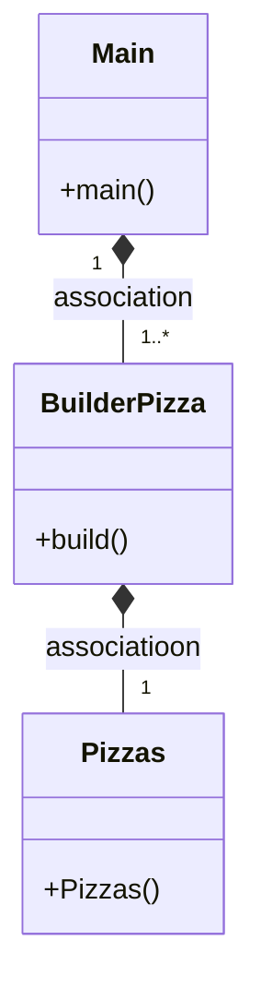
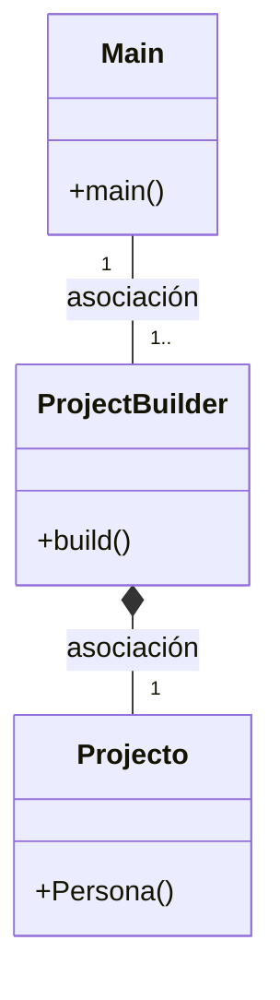

# ¿Cual es la función del patrón builder?
El patrón Builder es un patrón de diseño que se utiliza para crear objetos complejos paso a paso y permitir que el usuario final pueda personalizar el proceso de construcción sin conocer todos los detalles de su implementación.

Por ejemplo podríamos crear una clase Persona con diferentes atributos como nombre, edad, dirección, teléfono, correo... esta clase también tendría sus propios métodos:
getters, setters, constructor y toString.
Posteriormente crearemos la clase Builder en la cual crearemos un objeto de tipo persona con sus propios métodos y finalmente en la
clase main crearemos diferentes objetos de personas a los cuales le podremos meter diferentes atributos gracias a sus respectivos métodos y acompañado del metodo build()

# Diagrama proyecto

# Diagrama Ejemplo

